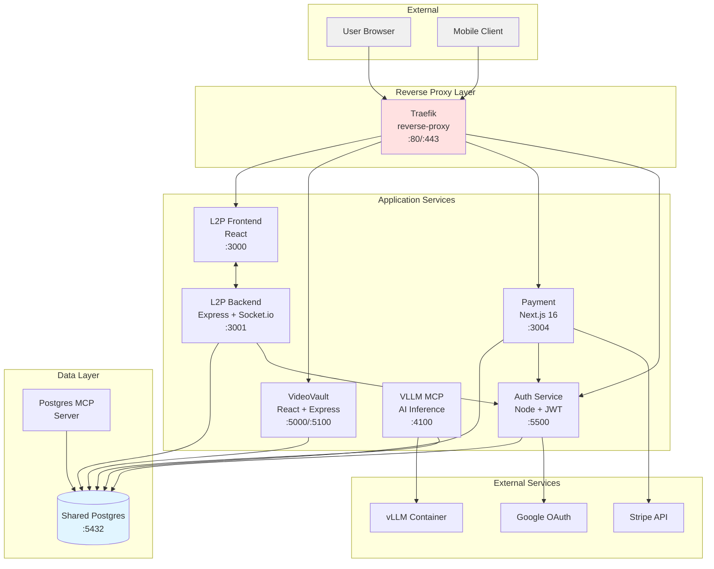
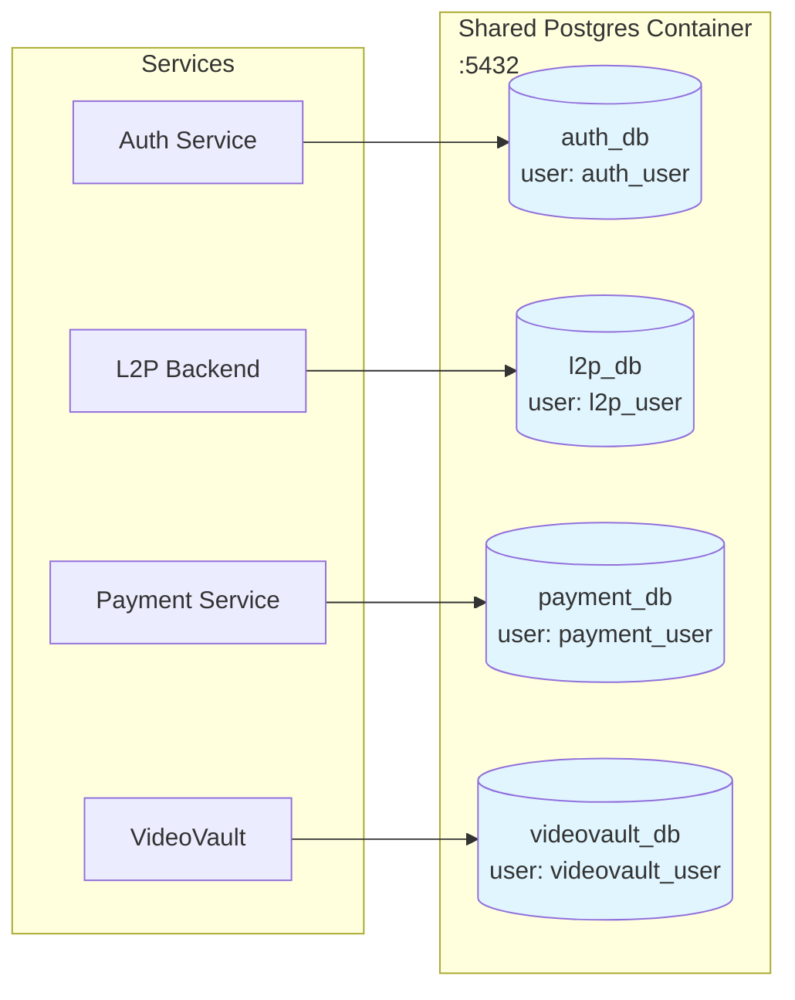
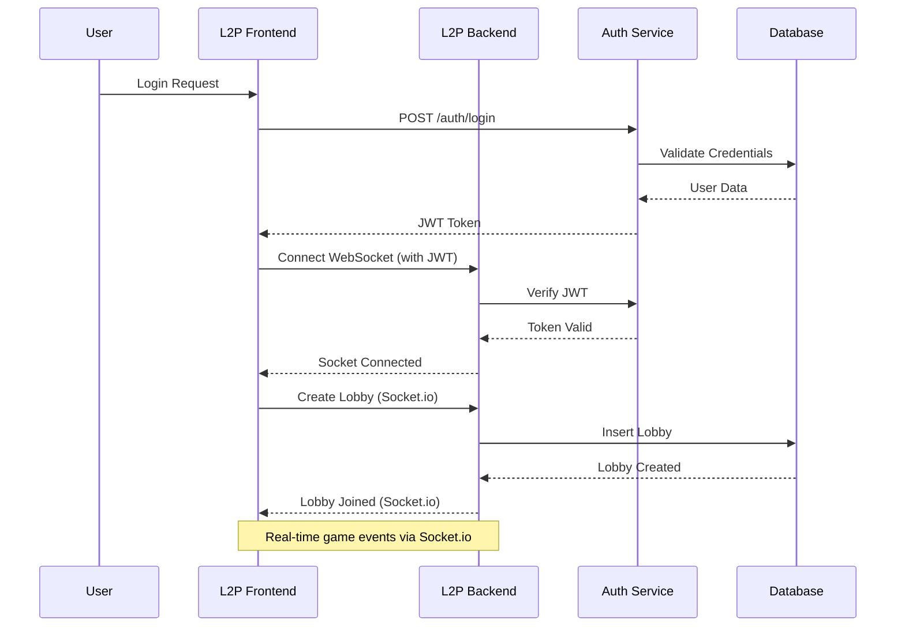
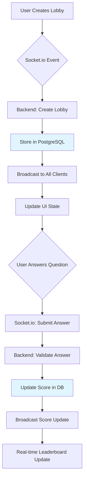
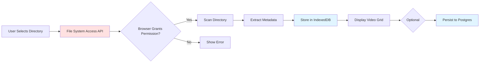
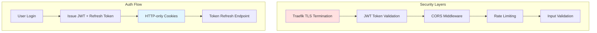
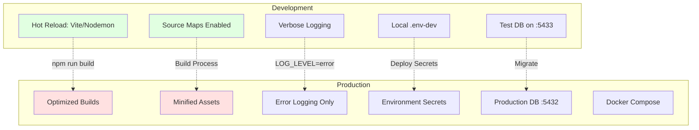

# Architecture Overview

Visual guide to the monorepo architecture, service interactions, and data flows.

## System Architecture



## Database Architecture

The monorepo uses a **centralized PostgreSQL instance** with isolated databases per service.



**Key Principles:**
- Single PostgreSQL container (`shared-postgres`)
- Isolated databases with dedicated users
- Prevents database sprawl
- Simplified backup and management
- Must start `shared-infrastructure` before other services

## Service Communication Patterns



## Technology Stack

| Layer | Technologies |
|-------|-------------|
| **Frontend** | React, Vite, Next.js 16 (Payment) |
| **Backend** | Express, Node.js, Socket.io |
| **Database** | PostgreSQL 15+, Prisma, Drizzle |
| **Auth** | JWT, NextAuth v5, OAuth 2.0 |
| **Real-time** | Socket.io (WebSockets) |
| **Testing** | Jest, Vitest, Playwright, Testing Library |
| **Deployment** | Docker, Docker Compose, Traefik |
| **AI/ML** | vLLM, MCP (Model Context Protocol) |

## Port Allocation

| Service | Dev Port | Prod Port | Protocol |
|---------|----------|-----------|----------|
| L2P Frontend | 3000 | 3007 | HTTP |
| L2P Backend | 3001 | 3008 | HTTP + WS |
| Payment | 3004 | 3005 | HTTP |
| Auth | 5500 | 5501 | HTTP |
| VideoVault | 5100/5000 | 5001 | HTTP |
| VLLM Dashboard | 4242 | - | HTTP |
| Shared Postgres | 5432 | 5432 | TCP |
| Traefik | 80/443 | 80/443 | HTTP/HTTPS |

## Data Flow Patterns

### L2P Real-time Game Flow



### VideoVault File Access Flow



### Payment Stripe Flow

```mermaid
sequenceDiagram
    participant User
    participant Frontend
    participant Backend
    participant Stripe
    participant DB

    User->>Frontend: Initiate Payment
    Frontend->>Backend: Create Payment Intent
    Backend->>Stripe: POST /payment_intents
    Stripe-->>Backend: Client Secret
    Backend-->>Frontend: Client Secret

    Frontend->>Stripe: Confirm Payment (Stripe.js)
    Stripe-->>Frontend: Payment Success
    Frontend->>Backend: Confirm Success

    Stripe->>Backend: Webhook: payment_intent.succeeded
    Backend->>DB: Update Order Status
    Backend-->>Stripe: 200 OK

    style Stripe fill:#ffe1e1
    style DB fill:#e1f5ff
```

## Security Architecture



**Security Features:**
- TLS/HTTPS via Traefik
- JWT-based authentication
- HTTP-only cookies for token storage
- Refresh token rotation
- CORS protection
- Rate limiting per route
- Input validation and sanitization
- Database user isolation

## Development vs Production



## Links

- [[Repository Index]] - Service directory
- [[Testing Strategy]] - Testing architecture
- [[Database Architecture]] - Database details
- [[Deployment Architecture]] - Deployment guide
- [[Repos/l2p|L2P Details]]
- [[Repos/VideoVault|VideoVault Details]]
- [[Repos/payment|Payment Details]]
