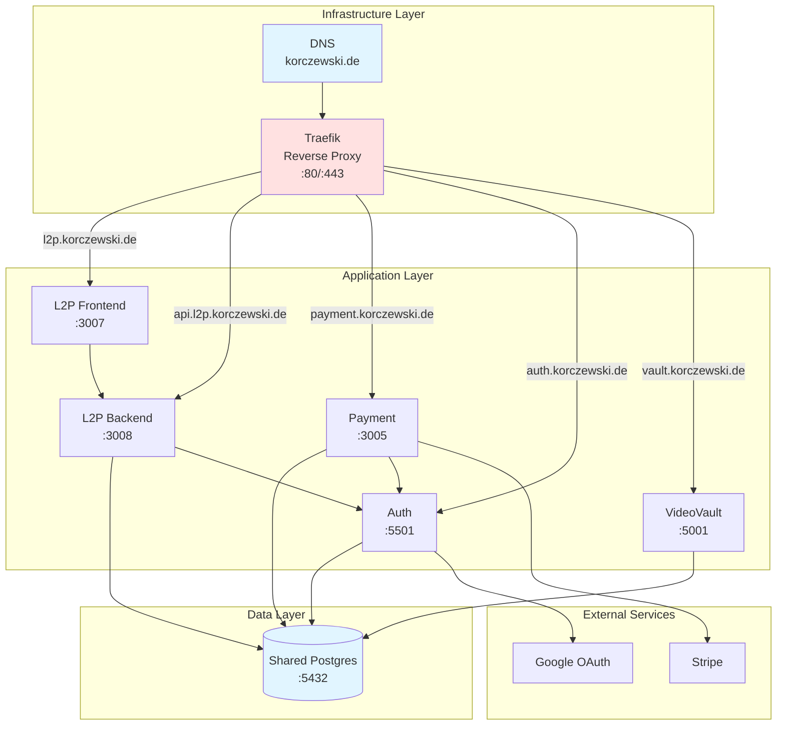
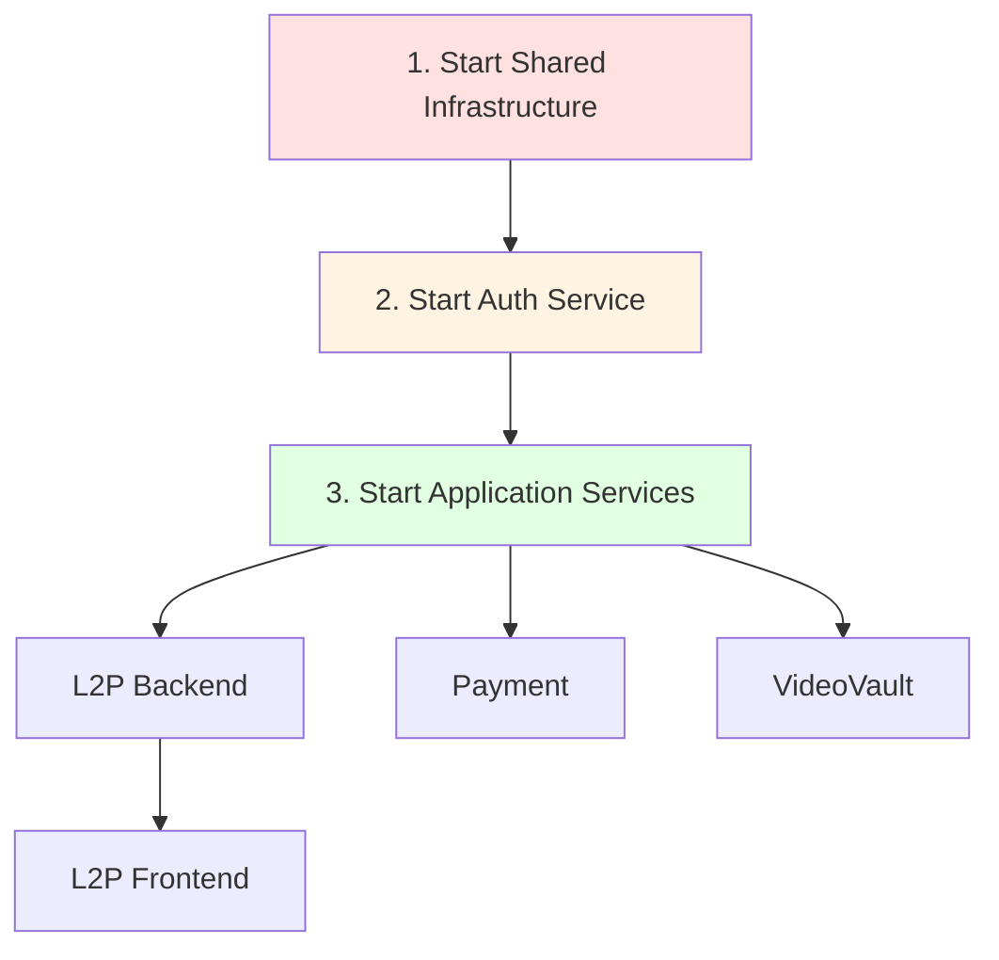
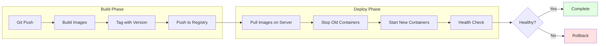
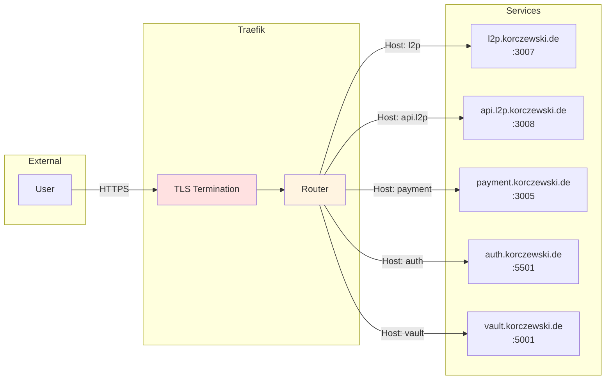
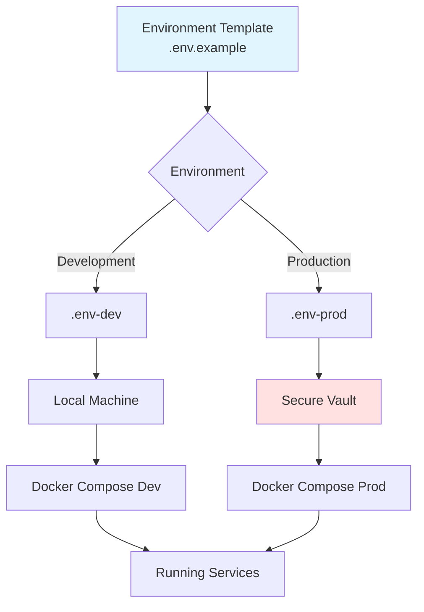
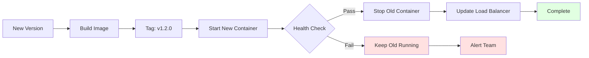
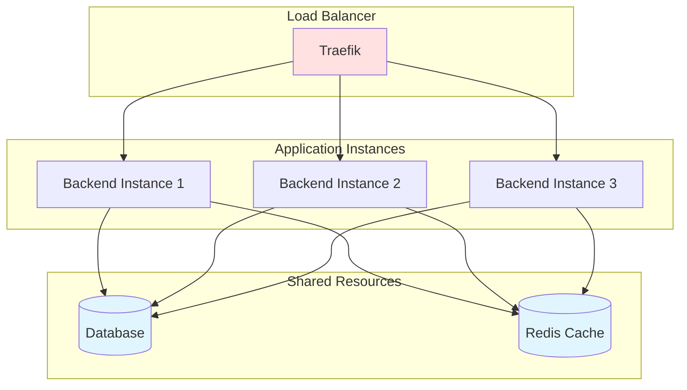
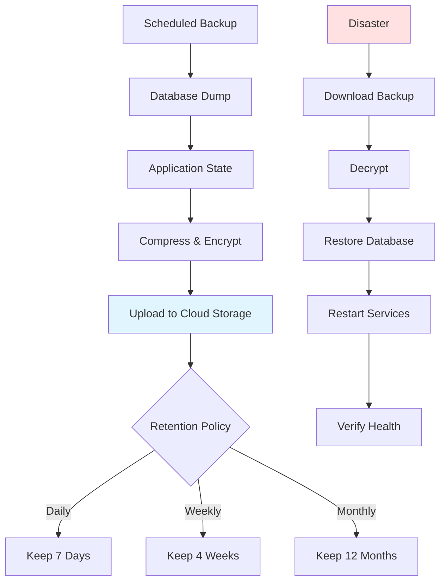
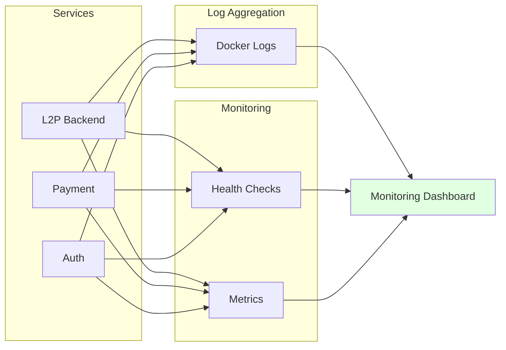
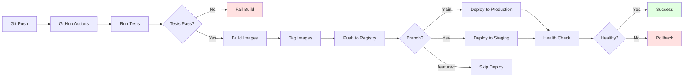

# Deployment Architecture

Complete guide to deploying the monorepo stack in development and production environments.

## Deployment Overview



## Environment Comparison

| Aspect | Development | Production |
|--------|-------------|------------|
| **Domain** | localhost | korczewski.de |
| **HTTPS** | No (HTTP only) | Yes (TLS via Traefik) |
| **Env File** | `.env-dev` | `.env-prod` |
| **Builds** | Hot reload | Optimized builds |
| **Source Maps** | Enabled | Disabled |
| **Logging** | Verbose | Error only |
| **Database** | Separate test DB :5433 | Production :5432 |
| **Secrets** | Local only | Secure vault |

## Development Deployment

### Quick Start All Services

```bash
# From repository root
./scripts/start-all-services.sh
```

This starts:
1. Shared infrastructure (Postgres)
2. Auth service
3. L2P backend & frontend
4. Payment service
5. VideoVault
6. Reverse proxy

### Manual Service Start



```bash
# 1. Shared infrastructure (MUST START FIRST)
cd shared-infrastructure
docker-compose --env-file .env-dev up -d

# 2. Auth service
cd auth
docker-compose --env-file .env-dev up -d

# 3. Individual services
cd l2p
npm run dev:backend    # Terminal 1
npm run dev:frontend   # Terminal 2

cd payment
npm run dev            # Terminal 3

cd VideoVault
npm run dev            # Terminal 4
```

### L2P Docker Development

```bash
cd l2p

# Start full stack
npm run deploy:dev

# View logs
npm run deploy:logs

# Stop stack
npm run deploy:down
```

**Access Points:**
- Frontend: http://localhost:3007
- Backend: http://localhost:3008

## Production Deployment

### Production Stack



### Production Deployment Steps

```bash
# 1. Build all services
npm run build:all

# 2. Start production stack
./scripts/start-all-production.sh

# 3. Health check
./scripts/health-check.sh

# 4. Monitor logs
./scripts/monitor-logs.sh
```

### L2P Production Deployment

```bash
cd l2p

# Build production images
npm run deploy:prod

# Or use docker-compose directly
docker-compose -f docker-compose.prod.yml --env-file .env-prod up -d

# View production logs
docker-compose -f docker-compose.prod.yml logs -f

# Stop production
docker-compose -f docker-compose.prod.yml down
```

## Docker Compose Architecture

### Development Stack

```yaml
# docker-compose.yml (simplified)
services:
  frontend:
    build:
      context: ./frontend
      target: development
    volumes:
      - ./frontend/src:/app/src  # Hot reload
    environment:
      - NODE_ENV=development

  backend:
    build:
      context: ./backend
      target: development
    volumes:
      - ./backend/src:/app/src   # Hot reload
    depends_on:
      - shared-postgres
```

### Production Stack

```yaml
# docker-compose.prod.yml (simplified)
services:
  frontend:
    build:
      context: ./frontend
      target: production
    environment:
      - NODE_ENV=production
    restart: unless-stopped

  backend:
    build:
      context: ./backend
      target: production
    environment:
      - NODE_ENV=production
    restart: unless-stopped
    depends_on:
      - shared-postgres
    healthcheck:
      test: ["CMD", "curl", "-f", "http://localhost:3001/health"]
      interval: 30s
      timeout: 10s
      retries: 3
```

## Traefik Routing



### Traefik Configuration

```yaml
# traefik.yml (simplified)
entryPoints:
  web:
    address: ":80"
    http:
      redirections:
        entryPoint:
          to: websecure
          scheme: https

  websecure:
    address: ":443"

certificatesResolvers:
  letsencrypt:
    acme:
      email: admin@korczewski.de
      storage: /letsencrypt/acme.json
      httpChallenge:
        entryPoint: web
```

## Health Checks

```mermaid
sequenceDiagram
    participant HC as Health Check Script
    participant Services as Services
    participant DB as Database

    HC->>Services: GET /health
    Services->>DB: Check Connection
    DB-->>Services: Connection OK
    Services-->>HC: 200 OK

    loop Every 30s
        HC->>Services: Ping
        Services-->>HC: Status
    end

    HC->>HC: Aggregate Status
    HC-->>HC: Report Overall Health

    style DB fill:#e1f5ff
```

### Health Check Endpoints

```bash
# L2P Backend
curl http://localhost:3001/health

# Payment
curl http://localhost:3004/api/health

# Auth
curl http://localhost:5500/health

# VideoVault
curl http://localhost:5100/health
```

### Automated Health Check Script

```bash
./scripts/health-check.sh

# Output:
# ✓ L2P Backend: Healthy
# ✓ L2P Frontend: Healthy
# ✓ Payment: Healthy
# ✓ Auth: Healthy
# ✓ VideoVault: Healthy
# ✓ Shared Postgres: Healthy
```

## Environment Variables Management



### Environment Validation

```bash
# Validate all environment files
npm run validate:env

# Validate development
npm run validate:env:dev

# Validate production
npm run validate:env:prod
```

## Rolling Updates



### Zero-Downtime Deployment

```bash
# 1. Build new version
docker build -t l2p-backend:v1.2.0 ./backend

# 2. Start new container (different name)
docker run -d --name l2p-backend-new l2p-backend:v1.2.0

# 3. Wait for health check
./scripts/wait-for-health.sh l2p-backend-new

# 4. Update load balancer to point to new container

# 5. Stop old container
docker stop l2p-backend-old
docker rm l2p-backend-old

# 6. Rename new container
docker rename l2p-backend-new l2p-backend
```

## Scaling Strategy



### Horizontal Scaling

```bash
# Scale backend to 3 instances
docker-compose up -d --scale backend=3

# Traefik automatically load balances across instances
```

## Backup and Recovery



### Backup Commands

```bash
# Full system backup
./scripts/backup-all.sh

# Database only
cd shared-infrastructure
docker-compose exec shared-postgres pg_dumpall -U postgres | gzip > backup_$(date +%Y%m%d).sql.gz

# Restore
gunzip -c backup_20260112.sql.gz | docker-compose exec -T shared-postgres psql -U postgres
```

## Monitoring and Logs



### Log Commands

```bash
# View all logs
docker-compose logs -f

# View specific service
docker-compose logs -f backend

# View last 100 lines
docker-compose logs --tail=100 backend

# View logs since timestamp
docker-compose logs --since 2026-01-12T10:00:00 backend
```

## CI/CD Pipeline



## Troubleshooting Deployments

### Common Issues

| Issue | Symptom | Solution |
|-------|---------|----------|
| Service won't start | Container exits immediately | Check logs: `docker-compose logs service_name` |
| Port already in use | `EADDRINUSE` | Stop conflicting service or change port |
| Database connection fails | `ECONNREFUSED` | Start `shared-infrastructure` first |
| Environment variable missing | Service crashes on start | Check `.env` file exists and is valid |
| Build fails | Docker build error | Clear cache: `docker-compose build --no-cache` |
| Health check fails | Container marked unhealthy | Check health endpoint responds correctly |

### Debug Commands

```bash
# Check running containers
docker ps

# Check container logs
docker logs <container_id>

# Enter container shell
docker exec -it <container_id> /bin/sh

# Check container environment
docker exec <container_id> env

# Restart service
docker-compose restart service_name

# Rebuild and restart
docker-compose up -d --build service_name
```

## Security Checklist

- [ ] HTTPS enabled via Traefik
- [ ] Environment secrets not committed
- [ ] Database passwords are strong and unique
- [ ] JWT secrets are 32+ characters
- [ ] CORS configured correctly
- [ ] Rate limiting enabled
- [ ] Input validation in place
- [ ] Docker containers run as non-root
- [ ] Firewall configured
- [ ] Regular security updates applied

## Links

- [[Architecture Overview]] - System architecture
- [[Database Architecture]] - Database details
- [[Operations]] - Daily operations
- [[Environment & Secrets]] - Environment management
- [[Repos/reverse-proxy|Traefik Details]]
- [[Repos/shared-infrastructure|Infrastructure Details]]
