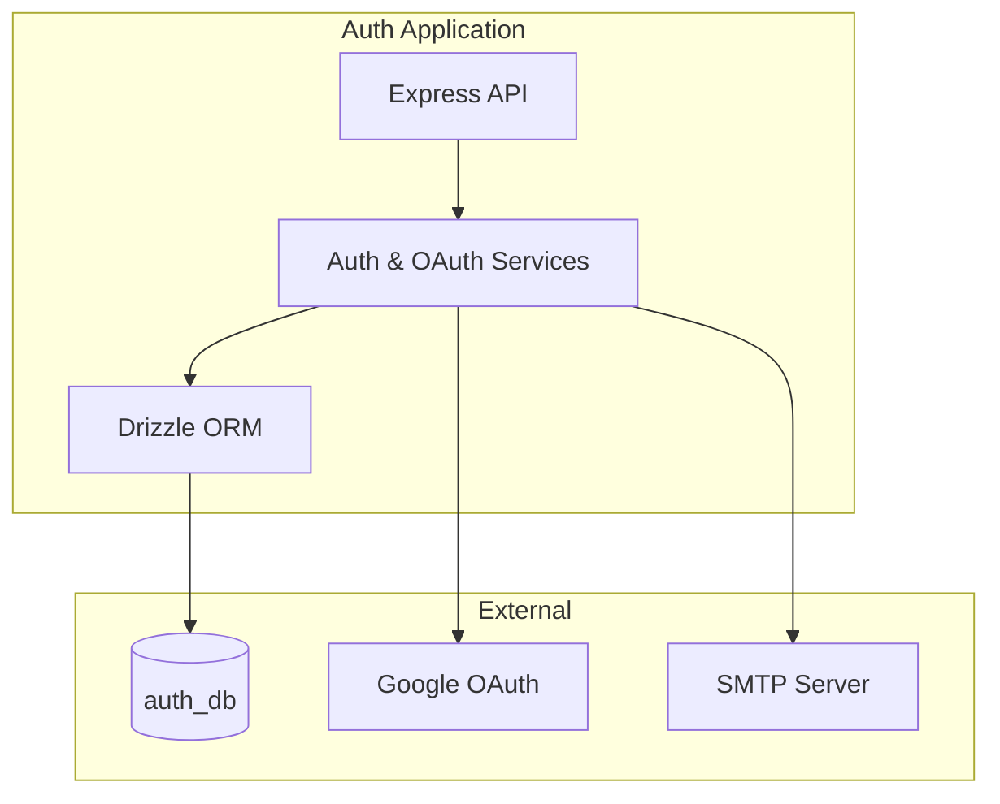

# Auth Service

## Purpose
Unified authentication service (JWT + OAuth) for all applications in the monorepo. It handles user registration, login, token management, and social authentication.

## Stack
- **Backend**: Node.js, Express, Drizzle ORM
- **Auth**: JWT (Access + Refresh tokens), Google OAuth 2.0
- **Database**: PostgreSQL (auth_db)
- **Communication**: REST API for token exchange and validation

## Quick Start
```bash
cd auth
# Ensure shared-infrastructure is running
docker-compose --env-file ../.env up -d
```

## Key Scripts
- `npm run dev` - Start local development server (port 5500)
- `docker-compose up -d` - Run service in Docker
- `npm test` - Run test suite
- `npm run db:push` - Sync database schema with Drizzle

## Architecture

### System Overview


### Key Components
- `src/routes/` - Endpoints for login, register, and OAuth callbacks
- `src/services/` - Logic for JWT issuance, password hashing, and email sending
- `src/db/` - Drizzle schema and database connection
- `src/middleware/` - JWT validation and error handling

## Auth Flows

### JWT Issuance
1. User provides credentials or OAuth code.
2. Service validates and fetches user from `auth_db`.
3. Service issues an **Access Token** (short-lived) and a **Refresh Token** (long-lived, HTTP-only cookie).

### OAuth 2.0 (Google)
1. Frontend redirects user to `/api/oauth/google`.
2. User authenticates with Google.
3. Google redirects back to `/api/oauth/google/callback`.
4. Service exchanges code for tokens and issues app-specific JWTs.

## Environment Setup
Required variables in root `.env`:
- `AUTH_PORT=5500`
- `AUTH_DATABASE_URL` - Connection string to `auth_db`
- `AUTH_JWT_SECRET` / `AUTH_JWT_REFRESH_SECRET`
- `AUTH_SESSION_SECRET`
- `AUTH_GOOGLE_CLIENT_ID` / `AUTH_GOOGLE_CLIENT_SECRET`

## Ports
- **Local Dev**: 5500
- **Production**: 5500 (via Traefik at `auth.korczewski.de`)

## Links
- [[Architecture Overview]] - System architecture
- [[Database Architecture]] - Database details
- [[Operations]] - Daily operations
- [[Repository Index]] - Back to index
