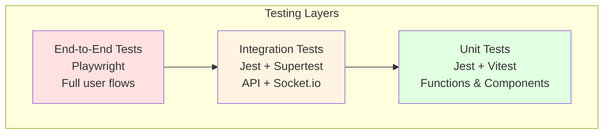
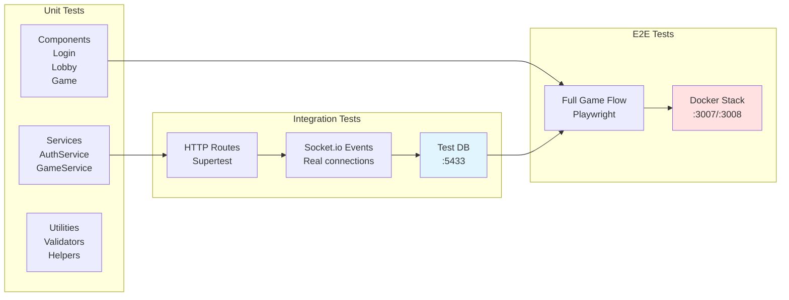
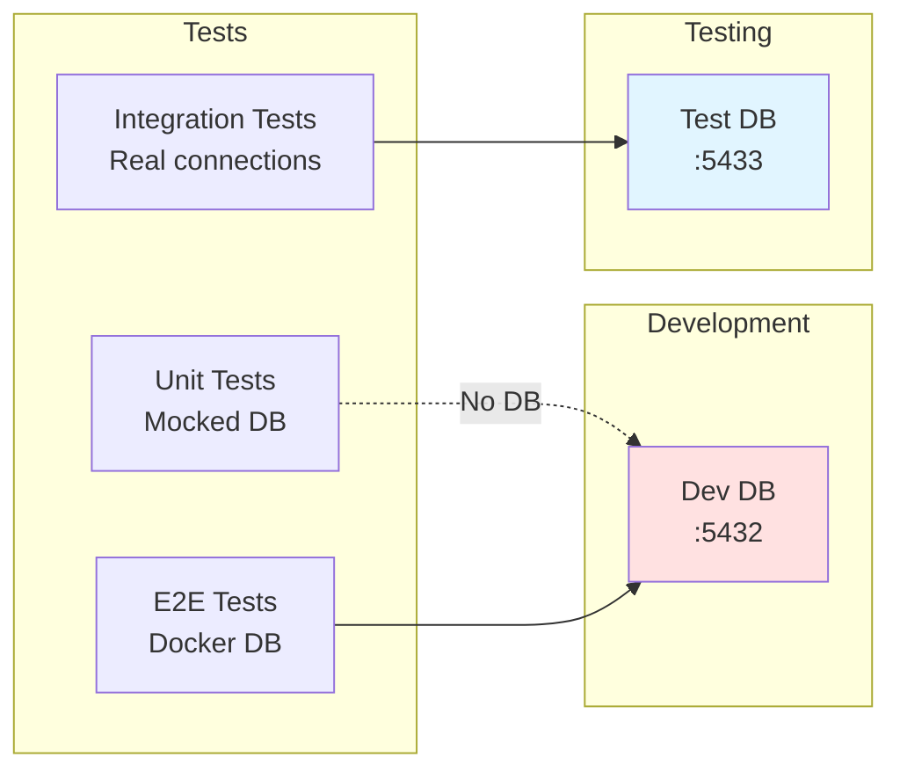
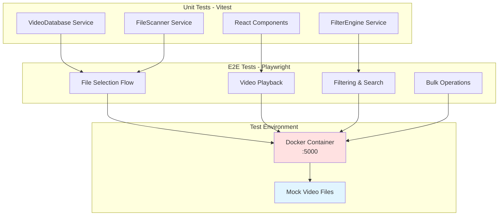
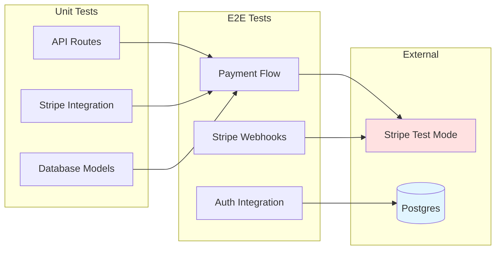
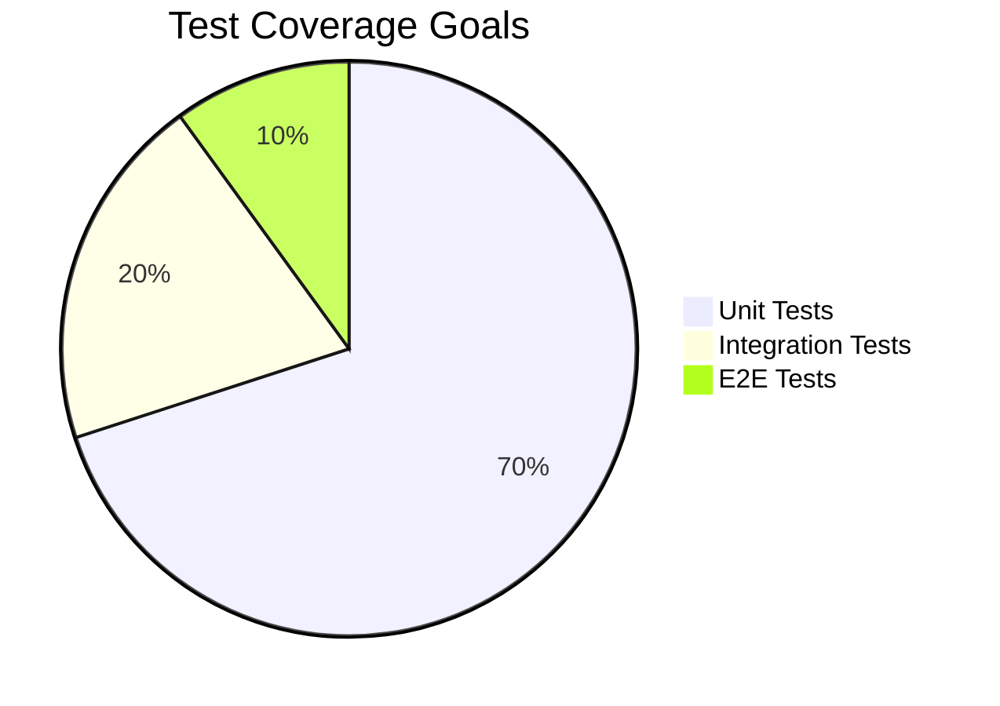
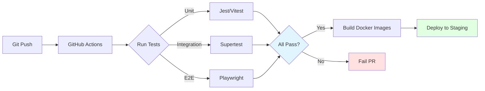

# Testing Strategy

Comprehensive testing approach across the monorepo with visual test architecture.

## Testing Pyramid



**Philosophy:**
- **Many unit tests** - Fast, isolated, test business logic
- **Some integration tests** - Test service interactions
- **Few E2E tests** - Test critical user paths only

## Test Architecture by Project

### L2P Testing Architecture



#### L2P Test Commands

```bash
# Run all tests
cd l2p
npm run test:all

# Unit tests only (fast)
npm run test:unit
npm run test:unit:frontend
npm run test:unit:backend

# Integration tests (slower)
npm run test:integration
npm run test:integration:frontend
npm run test:integration:backend

# E2E tests (slowest)
npm run test:e2e

# Watch mode for rapid development
npm run test:watch
```

#### L2P Test Database



**Key Points:**
- Integration tests use separate DB on port **5433**
- Prevents interference with development data
- Tests run with `--forceExit --detectOpenHandles` to handle Socket.io cleanup
- All tests use `NODE_OPTIONS=--experimental-vm-modules` for ESM support

### VideoVault Testing Architecture



#### VideoVault Test Commands

```bash
cd VideoVault

# Unit tests
npm test
npm run test:watch

# Type checking
npm run check

# Full verification (types + tests + build)
npm run verify

# E2E with Docker
npm run docker:pw:all    # Complete E2E suite
npm run docker:pw:up     # Start test environment
npm run docker:pw:run    # Run tests only
npm run docker:down      # Cleanup
```

**Key Constraints:**
- File System Access API requires Chromium-based browsers
- E2E tests need Docker environment with test video files
- Unit tests mock File System API

### Payment Testing Architecture



#### Payment Test Commands

```bash
cd payment

# All tests
npm test

# E2E tests
npm run test:e2e

# Lint
npm run lint
```

## Test Environment Management

```mermaid
sequenceDiagram
    participant Dev as Developer
    participant Test as Test Runner
    participant Env as Environment Setup
    participant DB as Test Database
    participant App as Application

    Dev->>Test: Run Tests
    Test->>Env: Load .env.test
    Env->>DB: Create Test Schema
    DB-->>Env: Ready
    Env->>App: Start Test Instance
    App-->>Test: Application Ready

    loop Each Test
        Test->>App: Execute Test
        App->>DB: Test Operations
        DB-->>App: Results
        App-->>Test: Assertions
    end

    Test->>DB: Cleanup/Rollback
    Test->>App: Shutdown
    Test-->>Dev: Test Results

    style DB fill:#e1f5ff
```

## Running Single Tests

### L2P Single Test File

```bash
cd l2p

# Backend unit test
cd backend
NODE_OPTIONS=--experimental-vm-modules npx jest src/services/AuthService.test.ts

# Frontend unit test
cd frontend
NODE_ENV=test npx jest src/components/Login.test.tsx

# Integration test
cd backend
NODE_OPTIONS=--experimental-vm-modules npx jest src/__tests__/integration/auth.test.ts

# Single E2E spec
cd frontend/e2e
npx playwright test tests/login.spec.ts
```

### VideoVault Single Test

```bash
cd VideoVault

# Single unit test file
npm run test -- client/src/services/VideoDatabase.test.ts

# Single E2E spec
cd e2e
npx playwright test tests/video-selection.spec.ts
```

## Test Coverage Strategy



**Coverage Targets:**
- **Unit Tests**: 80%+ coverage for services and utilities
- **Integration Tests**: All API endpoints and Socket.io events
- **E2E Tests**: Critical user paths (login, create game, play game, payment flow)

## Common Test Patterns

### Mocking External Services

```typescript
// Mock database
jest.mock('../repositories/UserRepository');

// Mock Socket.io
const mockSocket = {
  emit: jest.fn(),
  on: jest.fn(),
  disconnect: jest.fn()
};

// Mock API calls
jest.mock('../services/apiService');
```

### Testing Async Operations

```typescript
// Wait for async updates
await waitFor(() => {
  expect(screen.getByText('Success')).toBeInTheDocument();
});

// Testing Socket.io events
await new Promise((resolve) => {
  socket.on('game:started', resolve);
});
```

### Test Database Cleanup

```typescript
beforeEach(async () => {
  await db.migrate.latest();
});

afterEach(async () => {
  await db.migrate.rollback();
});
```

## CI/CD Integration



## Debugging Failed Tests

### Jest Debug Mode

```bash
# Debug mode
node --inspect-brk node_modules/.bin/jest --runInBand

# Verbose output
npm test -- --verbose

# Show console.log
npm test -- --silent=false
```

### Playwright Debug Mode

```bash
# Debug with UI
npx playwright test --debug

# Show trace
npx playwright show-trace trace.zip

# Headed mode (see browser)
npx playwright test --headed
```

## Best Practices

1. **Test Isolation**: Each test should be independent
2. **Clear Names**: Describe what is being tested
3. **Arrange-Act-Assert**: Structure tests clearly
4. **Mock External Deps**: Don't hit real APIs in unit tests
5. **Clean Up**: Always clean up resources (sockets, DB connections)
6. **Fast Feedback**: Unit tests should run in seconds
7. **Deterministic**: Tests should not be flaky

## Links

- [[Architecture Overview]] - System architecture
- [[Repos/l2p|L2P Details]] - L2P testing specifics
- [[Repos/VideoVault|VideoVault Details]] - VideoVault testing details
- [[Repos/payment|Payment Details]] - Payment testing approach
